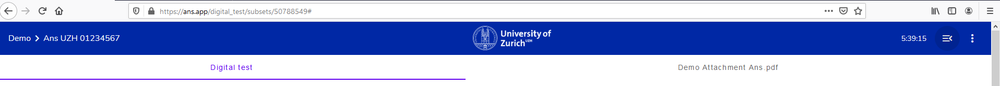
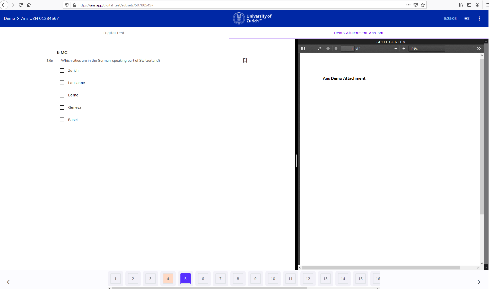

## Attachments

Wenn Attachements in der Prüfung vorhanden sind, dann ist dies **oben** in der Bildschirmansicht ersichtlich:

1. Um den Anhang einzusehen, klicke auf den Namen des Dokuments. Hier: **Demo Attachment Ans.pdf**

1. Nutze die **Split Screen** Funktion, um die Prüfung als auch den Anhang gleichzeitig anzuzeigen

**Split Screen Visualisierung**

