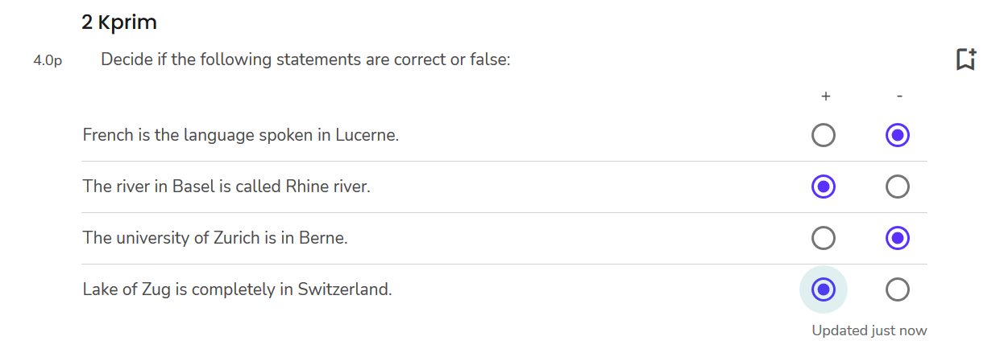

## Speichern der Antworten

Generell werden Ihre Antworten alle 30 Sekunden automatisch gespeichert. Der Speichervorgang wird rechts, unterhalb der jeweiligen Frage mit "Updated just now" angezeigt:

