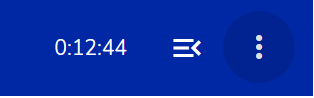
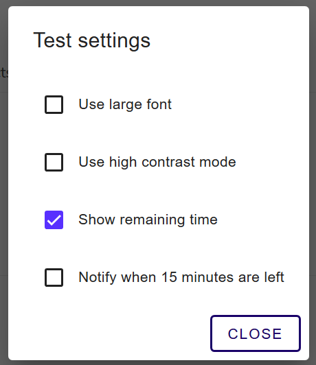
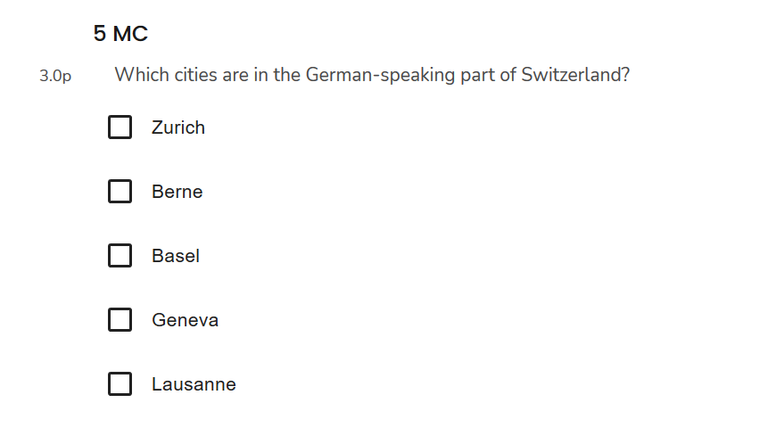
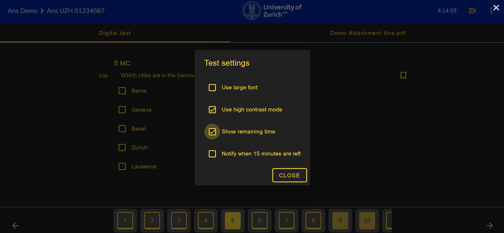
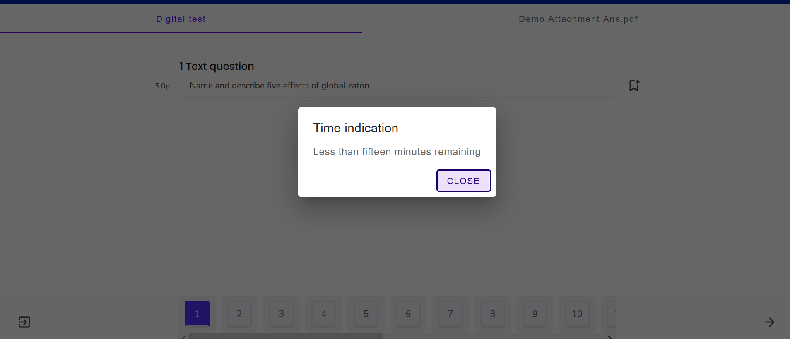

## Prüfungseinstellungen

Um die Prüfungseinstellungen anzupassen, müssen Sie sich innerhalb des Prüfungsmodus befinden:

1. Klicken Sie **oben rechts** auf das **"3-Punkte"-Icon** und wählen Sie **Settings** aus:

1. Ein Pop-Up zeigt Ihnen die möglichen Prüfungseinstellungen an:

Folgende Einstellungen können angepasst werden:
* **Schriftgrösse**
* **Kontrast**
* **Zeit**
* **Benachrichtung 15 Minuten vor Ende der Prüfung** 

1. **Schriftgrösse (Font)**
Klicken Sie die Box "Use large font", um die Schriftgrösse zu vergrössern. 
Vergleich der Schriftgrösse:
* Normal: 
* Gross: 

1. **Kontrast (Contrast)**
Klicken Sie die Box "Use high contrast mode", um den Kontrast zu aktivieren:

1. **Remaining Time**
Klicken Sie die Box "Show Remaining Time" an, um **oben-rechts** im Bild die verbleibende Zeit anzuzeigen:

1. **Benachrichtigung 15 Minuten vor Prüfungsende**
Wenn Sie die Box "Notify when 15 minutes are left" anwählen, werden Sie 15 Minuten vor Ablauf der Prüfungszeit mittels Pop-up-Nachricht darüber informiert:

