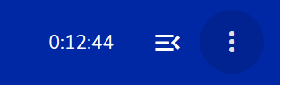

## Prüfungseinstellungen

Um die Prüfungseinstellungen anzupassen, müssen Sie sich innerhalb des Prüfungsmodus befinden:

1. Klicken Sie **oben rechts** auf das **"3-Punkte"-Icon**

 

2. Ein Pop-Up zeigt Ihnen die Prüfungseinstellungen an

 

Folgende Einstellungen können angepasst werden:
* Schriftgrösse
* Kontrast
* Zeit
* Benachrichtung 15 Minuten vor Ende der Prüfung 

1. Schriftgrösse (Font)

(Screenshots)

1. Contrast
(Screenshots)

1. Remaining Time
 Die verbleibende Zeit ist oben rechts ersichtlich **Hinweise**: dies ist die einzige Einstellung, die bereits ausgewählt ist
(Screenshots)

1. Benachrichtigung 15 Minuten vor Prüfungsende
(Screenshots)

