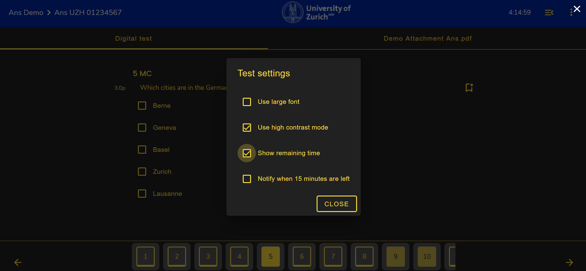

## Prüfungseinstellungen

Um die Prüfungseinstellungen anzupassen, müssen Sie sich innerhalb des Prüfungsmodus befinden:

1. Klicken Sie **oben rechts** auf das **"3-Punkte"-Icon**

 

2. Ein Pop-Up zeigt Ihnen die Prüfungseinstellungen an

 

Folgende Einstellungen können angepasst werden:
* Schriftgrösse
* Kontrast
* Zeit
* Benachrichtung 15 Minuten vor Ende der Prüfung 

1. Schriftgrösse (Font)

Klicken Sie die Box "Use large font", um die Schriftgrösse zu vergrössern. 
Vergleich der Schriftgrösse:

* Normal:  

* Gross:  

1. Kontrast (Contrast)

Klicken Sie die Box "Contrast", um den Kontrast zu aktivieren
 

1. Remaining Time

Klicken Sie die Box "Show Remaining Time" an, um **oben-rechts" im Bild die verbleibende Zeit anzuzeigen

 

1. Benachrichtigung 15 Minuten vor Prüfungsende

Wenn Sie die Box "Notify when 15 minutes are left" anwählen, werden Sie 15 Minuten vor Ablauf der Prüfung anhand eines Pop-Ups darüber informiert

 

[Back to top ](#top){: .btn }