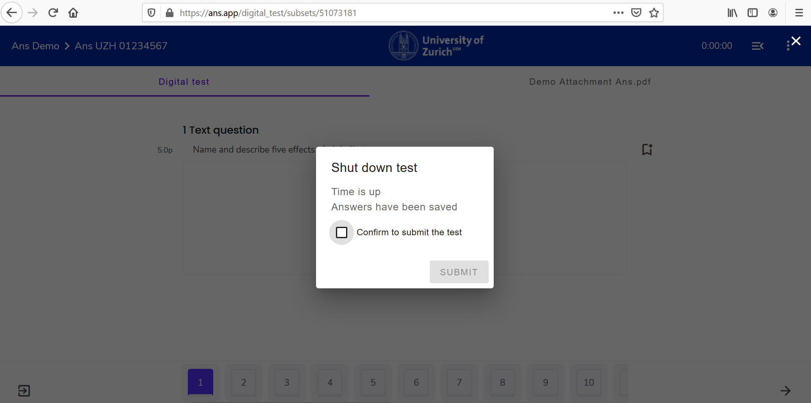

## Prüfung beenden

### Prüfung unterbrechen

(Are we doing this, considering the mentioned issue?)

### Prüfung eigenständig einreichen

Wenn Sie die Prüfung beenden wollen, so haben Sie 2 Möglichkeiten:

* Möglichkeit 1: Letzen Navigations-Pfeil anwählen:
Sind Sie bei der letzten Frage angekommen, so ist unten rechts im Bildschirm folgendes Icon ersichtlich:  

* Möglichkeit 2: Exit anhand des **"3-Punkte"-Icon** **oben-rechts** im Bildschirm:
Klicken Sie auf das **"3-Punkte"-Icon** und wählen Sie **Exit Test**:  

Beide Möglichkeiten zeigen daraufhin das gleiche Pop-up an:

Kreuzen Sie die Box **Confirm to submit the test** an und klicken Sie **Submit**.

**ACHTUNG**: Die Abgabe kann **NICHT** rückgängig gemacht werden. Wenn Sie sich nicht sicher sind, dann wählen Sie **RESUME LATER** oder drücken Sie die "Esc"-Taste.

### Prüfungszeit ist abgelaufen

Ist die Bearbeitungszeit der Prüfung zu Ende, dann erscheint ein Pop-up Fenster, welches Sie bittet die Prüfung einzureichen:

Kreuzen Sie die Box an und klicken Sie **Submit** um die Prüfung einzureichen:

**Hinweis**: Anders als beim aktiven Beenden der Prüfung, gibt es hier keinen **Resume**-Button.