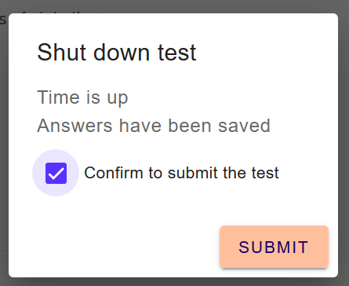

## Prüfung beenden

### Prüfung unterbrechen

(Are we doing this, considering the mentioned issue?)

### Prüfung eigenständig einreichen

Wenn Sie die Prüfung beenden wollen, so haben Sie 2 Möglichkeiten:

* Letzer Navigations-Pfeil anwählen: 
Sind Sie bei der letzten Frage angekommen, so ist unten rechts im Bildschirm folgendes Icon ersichtlich: 
 

### Prüfungszeit ist abgelaufen

Ist die Bearbeitungszeit der Prüfung zu Ende, dann erhalten Sie ein Pop-Up, welches Sie bittet die Prüfung einzureichen:
 

Kreuzen Sie die Box and und klicken Sie **Submit"" um die Prüfung einzureichen

 

**Hinweis**: Anders als beim aktiven Beenden der Prüfung, gibt es hier keinen **Resume**-Button