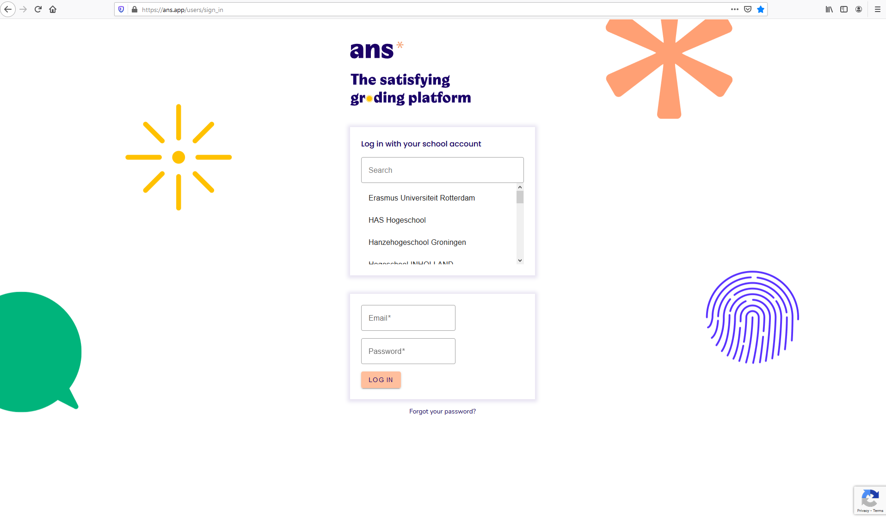
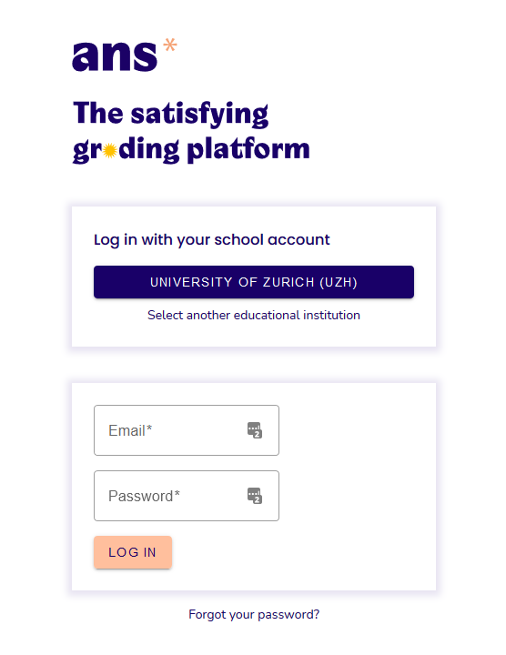

## Ans Login

1. Klicken Sie [hier](https://ans.app/users/sign_in){:target="_blank"} oder kopieren Sie den folgenden Link [https://ans.app/users/sign_in](https://ans.app/users/sign_in){:target="_blank"} in Ihren Browser (Firefox oder Chrome)

1. Unter **Log in with your school account** geben Sie “University of Zurich” oder "UZH" ein
](assets/login-uzh.png)

1. Sobald Sie “University of Zurich (UZH)" auswählen, werden Sie zum AAI-Login der Universität Zürich weitergeleitet und melden sich da mit Ihrer UZH-Kennung (shortname) und Passwort an

1. Bei erfolgreichem Login ist nun oben links Ihr Name & die Institution – University of Zurich – ersichtlich

***

**Hinweis:** Nach erstmaligem Login ist die Institutionseinstellung jeweils bereits vorvermerkt:

***

Bei Login-Problemen wenden Sie sich bitte an: [support@oec.uzh.ch](mailto:support@oec.uzh.ch)

[Back to top ](#top){: .btn }
