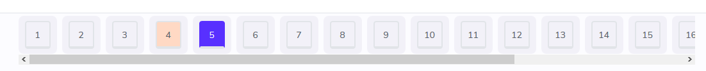
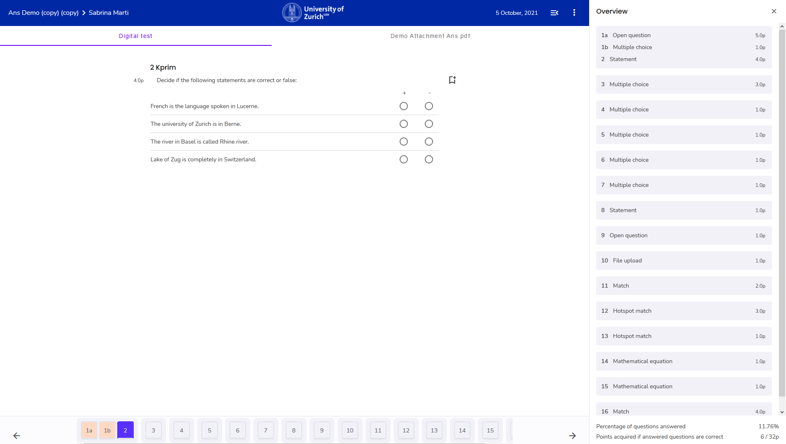
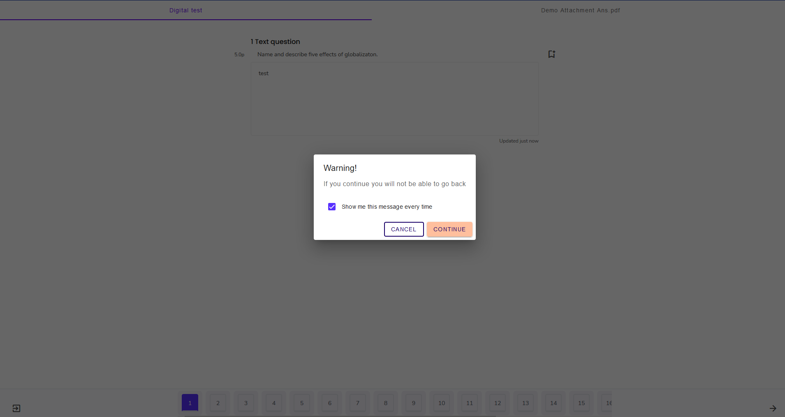
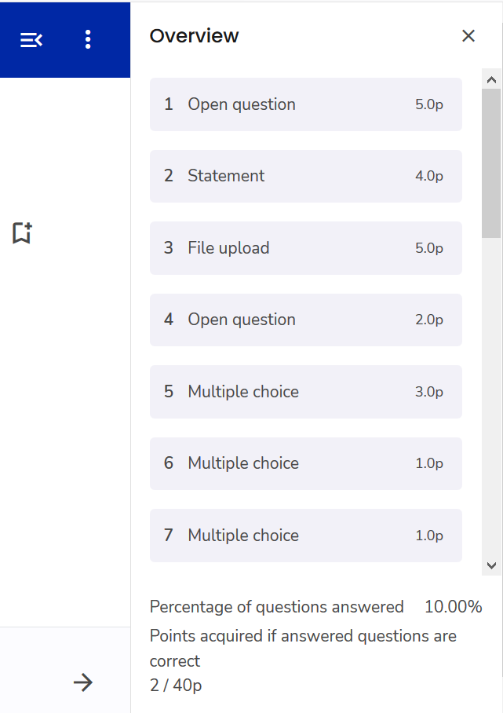

## Navigation in der Prüfung

Navigieren Sie anhand der Fragenleiste **unten** im Prüfungsfenster:

1. Möglichkeit: Navigieren anhand der Pfeile
* **Zurück** zur vorherigen Frage mit ← (Im Screenshot: unten links)
* **Weiter** zur nächsten Frage mit → (Im Screenshot: unten rechts)

1. Möglichkeit: spezifische Frage auswählen
Wählen Sie eine beliebige Seite / Frage an:

**Hinweis:** beantwortete Fragen sind «orange» markiert (siehe Frage 4).

**eingeschränkte Navigation**: Je nachdem, wie die Prüfung aufgesetzt wurde, ist es möglich, dass 
* Fragen nur der Reihe nach beantwortet werden können
* Fragengruppen nicht wieder geöffnet werden können, aber innerhalb des Fragenblocks navigiert werden kann. Fragengruppen sind in der Fragenleiste als auch in der Seitenleiste in einer gemeinsamen grauen Box untergebracht

In beiden Fällen wird eine Pop-Up Nachricht angezeigt, wenn man den **Weiter**-Pfeil anklickt bzw. in der Frageleiste eine andere Seite anklickt

Wenn die Warnung mit **Continue** bestätigt wird, ist die nächste Frage ersichtilch und die vorherige Frage oder die Fragengruppe ist mit einem **Schloss**-Symbol in der Frageleiste versehen

## Prüfungsübersicht

Abgesehen von der unteren Frageleiste gibt es zusätzlich die **Seitenleiste**, welche **oben-rechts** mit dem folgenden Icon ausgeklappt werden kann:  

Die Seitenleiste gibt eine Übersicht der Fragen mit Fragetyp und Punktzahl. Des Weiteren wird mittels prozentualem Anteil der beantworteten Fragen und Maximalpunktzahl der bereits beantworteten Fragen der Prüfungsfortschritt angezeigt: 

**Hinweis**: die Seitenleiste ist statisch, sodass es nicht möglich ist auf eine Frage zu klicken, um dahin zu gelangen. Bitte nutzen Sie dafür die [Frageleiste](#navigation-in-der-pr%C3%BCfung).

