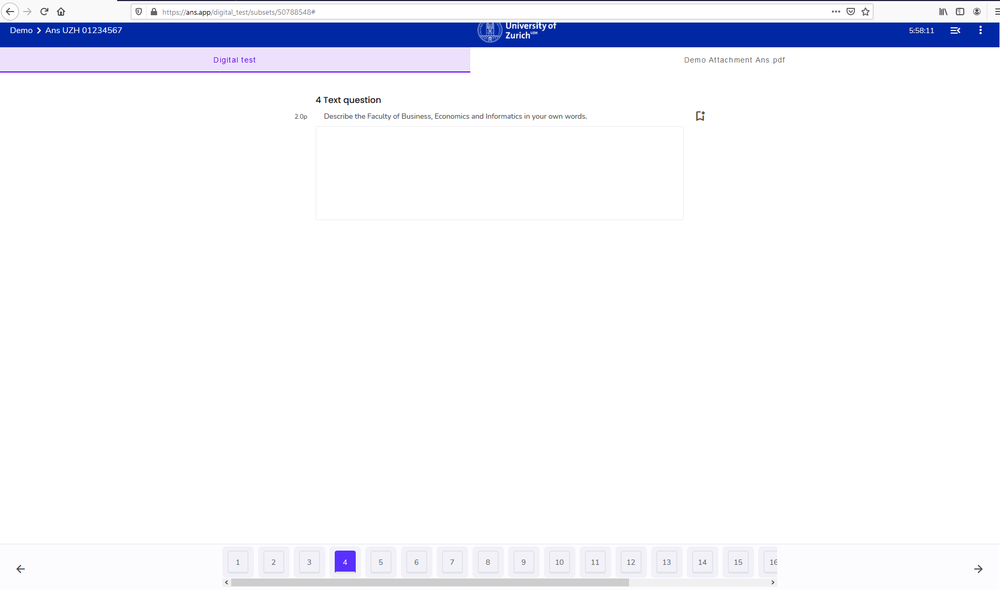

## Navigation in der Prüfung

Navigieren Sie anhand der Fragenleiste **unten** im Prüfungsfenster:

1. Möglichkeit: Navigieren anhand der Pfeile
* **Zurück** zur vorherigen Frage mit ← (Im Screenshot: unten links)
* **Weiter** zur nächsten Frage mit → (Im Screenshot: unten rechts)

1. Möglichkeit: spezifische Frage auswählen
Wählen Sie eine beliebige Seite / Frage an:

**Hinweis:** beantwortete Fragen sind «orange» markiert (siehe Frage 4).

## Prüfungsübersicht

Abgesehen von der unteren Frageleiste gibt es zusätzlich die **Seitenleiste**, welche **oben-rechts** mit dem folgenden Icon ausgeklappt werden kann:  

Die Seitenleiste gibt eine Übersicht der Fragen mit Fragetyp und Punktzahl. Des Weiteren wird mittels prozentualem Anteil der beantworteten Fragen und Maximalpunktzahl der bereits beantworteten Fragen der Prüfungsfortschritt angezeigt: 

**Hinweis**: die Seitenleiste ist statisch, sodass es nicht möglich ist auf eine Frage zu klicken, um dahin zu gelangen. Bitte nutzen Sie dafür die [Frageleiste](#navigation-in-der-pr%C3%BCfung).

