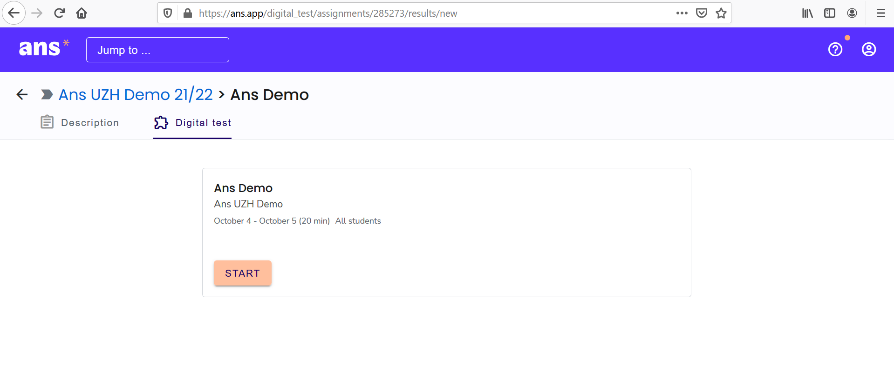

## Prüfung starten

Vor dem Start der Prüfung, sehen Sie den Leistungsnachweis unter "Scheduled assignment":

1. Wenn Sie auf die bevorstehende Prüfung (Scheduled Assignement) klicken, erscheint der Countdown:

1. Sobald der Countdown auf **00:00** fällt, lädt sich die Seite automatisch neu

1. Nun müssen Sie bestätigen, dass Sie sich an den Ehrenkodex halten werden und können die Prüfung im Anschluss mit dem Klick auf den **Start**-Button beginnen:

