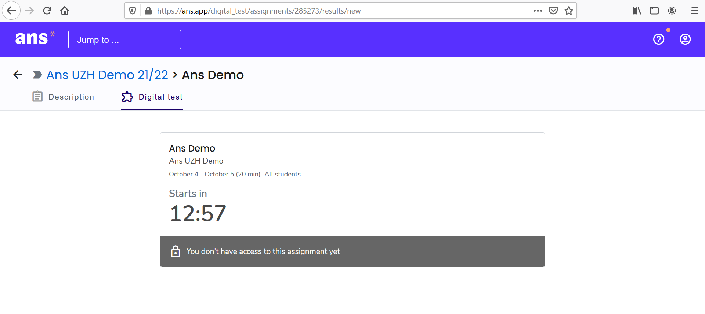

## Prüfung starten

Vor dem Start der Prüfung, sehen Sie das Assignement unter "Scheduled assignment"

1. Wenn Sie auf die bevorstehende Prüfung (Scheduled Assignement) klicken, erscheint der Countdown

1. Sobald der Countdown auf 00:00 fällt, lädt sich die Seite neu

1. Die Prüfung wird angezeigt und kann mit dem Klick auf den Start-Knopf begonnen werden

[Back to top ](#top){: .btn }

