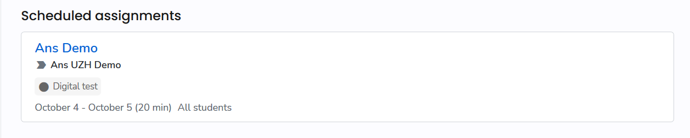
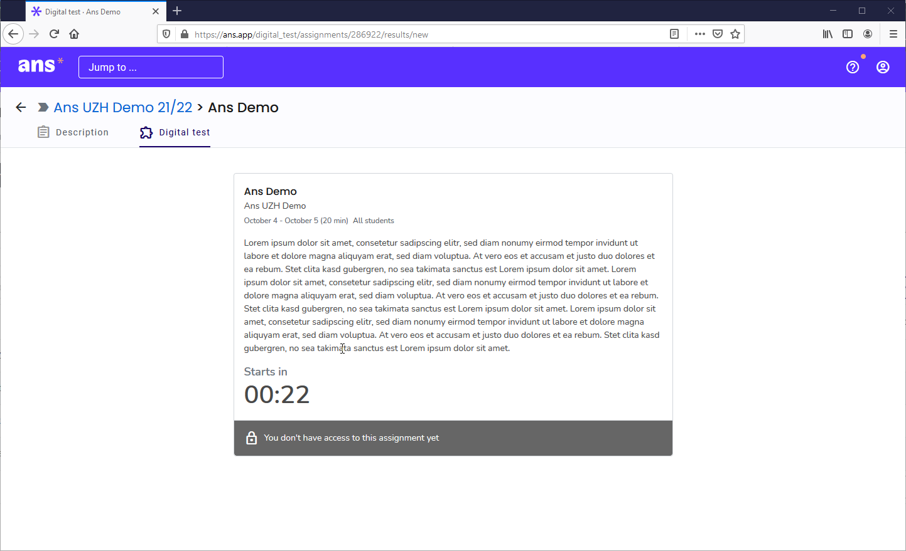
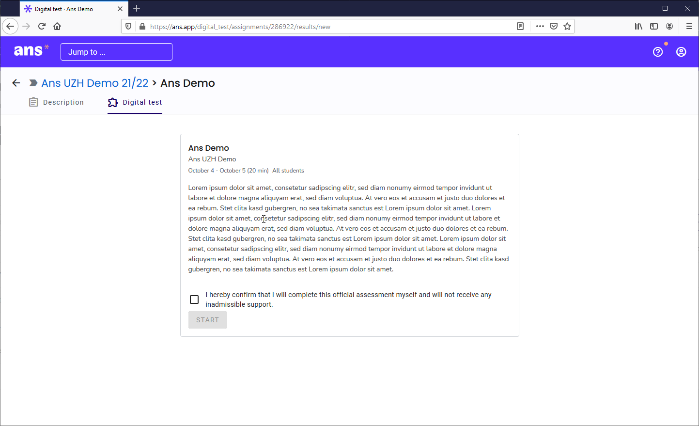

## Prüfung starten

Vor dem Start der Prüfung, sehen Sie den Leistungsnachweis unter "Scheduled assignments":

1. Wenn Sie auf die bevorstehende Prüfung (Scheduled Assignement) klicken, erscheint der Countdown:

1. Sobald der Countdown auf **00:00** fällt, lädt sich die Seite automatisch neu. (hat die Prüfung bereits begonnnen, dann ist der Countdown nicht mehr ersichtlich)

1. Nun müssen Sie bestätigen, dass Sie sich an den Ehrenkodex halten werden und können die Prüfung im Anschluss mit dem Klick auf den **Start**-Button beginnen:

**Hinweis: bei der Verwendung des Safe Exam Browser mit Ans ist das Starten der Prüfung anders. Sehen Sie dazu die [SEB Dokumentation](https://uzh-oec.github.io/seb/exam_seb_ans_de.html){:target="_blank"}.

