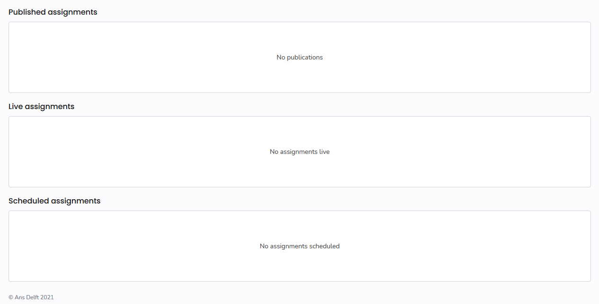
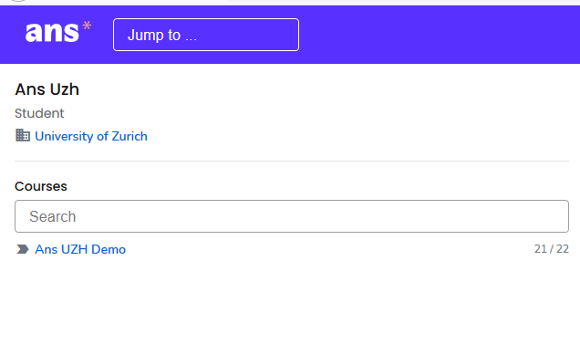

## Prüfung starten

1. Auf der rechten Seite der Plattform sehen Sie Ihnen zugewiesenen Assignments:
* Scheduled assignments (a)
* Live assignments (b)
* Published assignments (c)

1. Oben links finden Sie folgendes:
* Die Suchleiste (a)
* Ihren Namen und die Institution (b)
* Die Kurse in welchen Sie eingeschrieben sind (c)

1. Oben rechts finden Sie:
* Das Profilsymbol für Kontoeinstellungen & Logout  

* Das Hilfesymbol mit dem [Help Center](https://support.ans.app/hc/en-us){:target="_blank"} für weitere Ressourcen

[Back to top ](#top){: .btn }

